# 计算机组成原理-课程设计-31指令CPU

## 文章目录

- [1.前言](#1前言)
- [2.指令表](#2指令表)
- [3.数据通路图](#3数据通路图)
- [4.数据通路总图](#4数据通路总图)
- [5.控制部件设计](#5控制部件设计)
- [6.代码编写](#6代码编写)

## 1.前言

本实验中我将使用Verilog HDL语言设计一个31条指令单周期的CPU设计，并完成前仿真、后仿真和下板调试运行。设计CPU是一项繁杂的任务，在此过程中，要明确每一步设计流程，才能减少Debug的时间（改bug怎的很费时间），提高效率。\
大致流程如下：列出CPU指令表→绘制各个指令的数据流图→绘制数据流总图→列出指令信号表→编写代码实现CPU基础功能→测试→仿真下板

## 2.指令表

31条指令表如下：
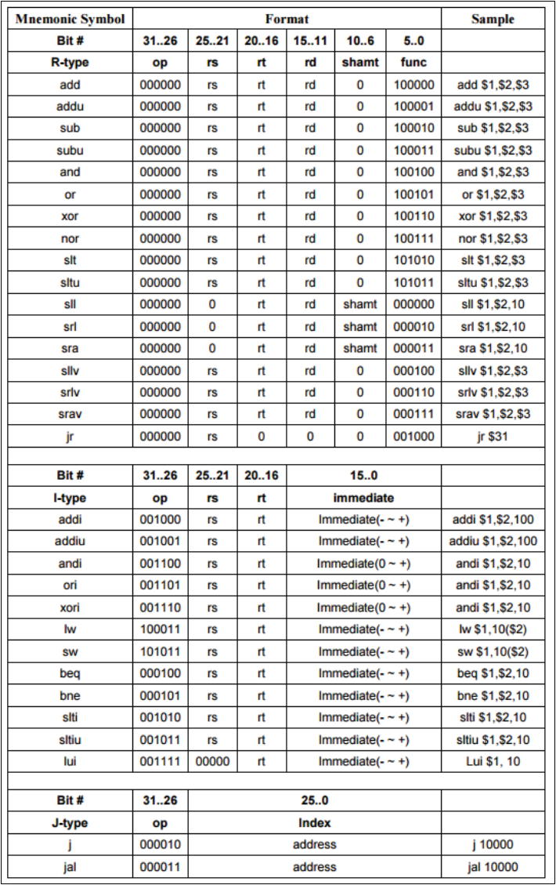
其中的指令可以分为三类，分别是：

R-type:\
OP为000000,由func来决定他的功能，主要用于操作寄存器之间的算术和逻辑运算。rs和rt是源寄存器，通常存操作数，rd是目标寄存器，通常存结果。shamt代表移位操作中的位移量，是立即数。

I-type:\
I型指令都包含了一个立即数（常数），用于与常数相关的计算，观察表发现，I型指令将rd，shamt，func替换为了immediate，因此I型指令由op直接决定，rs作为源寄存器，rd作为目标寄存器。

J-type:\
J型指令只有两条，用来实现无条件跳转。

## 3.数据通路图

### R-type

1.ADD\
格式：ADD rd,rs,rt\
目的：与32位数相加。\
描述：rd←rs+rt\
将通用寄存器中存的32位数据rs与rt相加产生一个32位数据存入目标寄存器rd。\
（1）如果发生了溢出，则rd不改变且产生一个溢出的异常\
（2）如果相加不溢出，则产生的32位数据直接存入目标寄存器rd。\
操作：rd←rs+rt,PC←NPC(PC+4)\
所需部件：PC、NPC、IMEM、Regfile、ALU。\
指令周期：\
·取指周期：\
PC→IMEM\
PC+4→NPC\
NPC→PC\
·执行周期：\
rs→A,rt→B\
(A+B→result)\
result→rd\
指令流程图：\
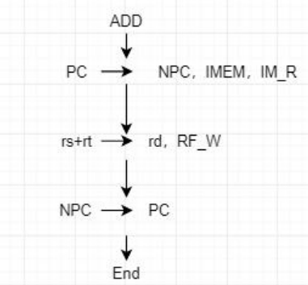

数据通路图：\
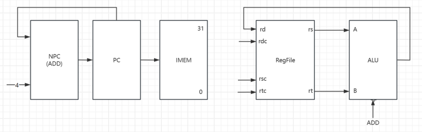

2.ADDU\
格式：ADDU rd,rs,rt\
目的：与32位数相加。\
描述：rd←rs+rt\
将通用寄存器中存的32位数据rs与rt相加产生一个32位数据存入目标寄存器rd。在任何情况下都不会有溢出的异常\
操作：rd←rs+rt,PC←NPC(PC+4)\
所需部件：PC、NPC、IMEM、Regfile、ALU。\
指令周期：\
·取指周期：\
PC→IMEM\
PC+4→NPC\
NPC→PC\
·执行周期：\
rs→A,rt→B\
(A+B→result)\
result→rd\
指令流程图：\
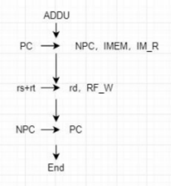

数据通路图：\
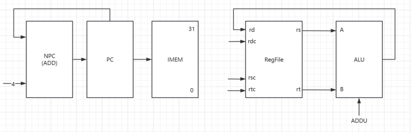

3.SUB\
格式：SUB rd,rs,rt\
目的：与32位数相减。\
描述：rd←rs-rt\
将通用寄存器中存的32位数据rs与rt相减产生一个32位数据存入目标寄存器rd。\
（1）如果发生了溢出，则rd不改变且产生一个溢出的异常\
（2）如果相减不溢出，则产生的32位数据直接存入目标寄存器rd。\
操作：rd←rs-rt,PC←NPC(PC+4)\
所需部件：PC、NPC、IMEM、Regfile、ALU。\
指令周期：\
·取指周期：\
PC→IMEM\
PC+4→NPC\
NPC→PC\
·执行周期：\
rs→A,rt→B\
(A-B→result)\
result→rd\
指令流程图：\
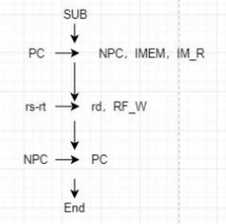

数据通路图：\
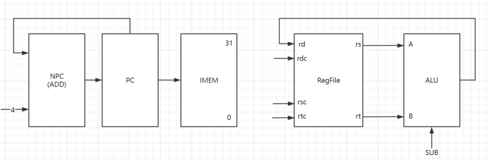

4.SUBU\
格式：SUBU rd,rs,rt\
目的：与32位数相减。\
描述：rd←rs-rt\
将通用寄存器中存的32位数据rs与rt相减产生一个32位数据存入目标寄存器rd。在任何情况下都不会有溢出的异常\
操作：rd←rs-rt,PC←NPC(PC+4)\
所需部件：PC、NPC、IMEM、Regfile、ALU。\
指令周期：\
·取指周期：\
PC→IMEM\
PC+4→NPC\
NPC→PC\
·执行周期：\
rs→A,rt→B\
(A-B→result)\
result→rd\
指令流程图：\
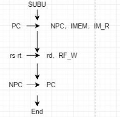

数据通路图：\
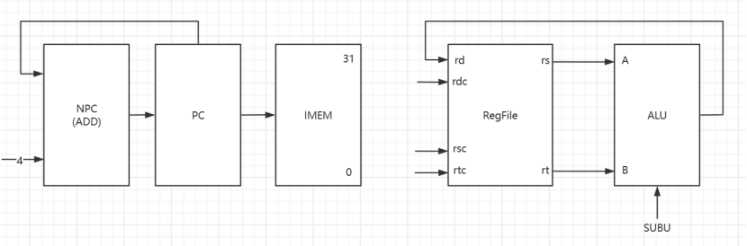

5.AND\
格式：AND rd,rs,rt\
目的：按位逻辑与。\
描述：rd←rs AND rt\
将通用寄存器rs和rt中的数据每一位做按位与操作，将结果存入目标寄存器rd中。\
操作：rd←rs AND rt,PC←NPC(PC+4)\
所需部件：PC、NPC、IMEM、Regfile、ALU。\
指令周期：\
·取指周期：\
PC→IMEM\
PC+4→NPC\
NPC→PC\
·执行周期：\
rs→A,rt→B\
(A AND B→result)\
result→rd\
指令流程图：\
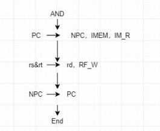

数据通路图：\
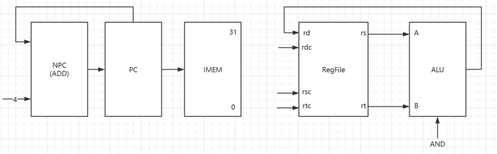
6.OR\
格式：OR rd,rs,rt\
目的：按位逻辑或。\
描述：rd←rs OR rt\
将通用寄存器rs和rt中的数据每一位做按位或操作，将结果存入目标寄存器rd中。\
操作：rd←rs OR rt,PC←NPC(PC+4)\
所需部件：PC、NPC、IMEM、Regfile、ALU。\
指令周期：\
·取指周期：\
PC→IMEM\
PC+4→NPC\
NPC→PC\
·执行周期：\
rs→A,rt→B\
(A OR B→result)\
result→rd\
指令流程图：\
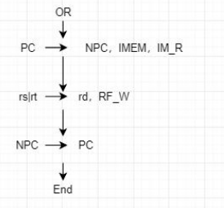

数据通路图：\
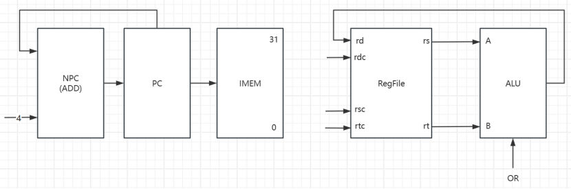

7.XOR\
格式：XOR rd,rs,rt\
目的：按位逻辑异或。\
描述：rd←rs XOR rt\
将通用寄存器rs和rt中的数据每一位做按位异或操作，将结果存入目标寄存器rd中。\
操作：rd←rs XOR rt,PC←NPC(PC+4)\
所需部件：PC、NPC、IMEM、Regfile、ALU。\
指令周期：\
·取指周期：\
PC→IMEM\
PC+4→NPC\
NPC→PC\
·执行周期：\
rs→A,rt→B\
(A XOR B→result)\
result→rd\
指令流程图：\
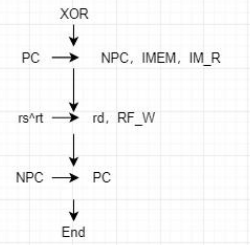

数据通路图：\
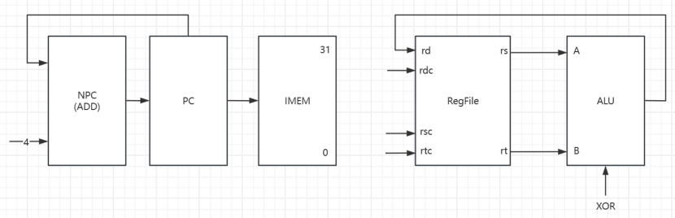

8.NOR\
格式：NOR rd,rs,rt\
目的：按位逻辑或非。\
描述：rd←rs NOR rt\
将通用寄存器rs和rt中的数据每一位做按位或非操作，将结果存入目标寄存器rd中。\
操作：rd←rs NOR rt,PC←NPC(PC+4)\
所需部件：PC、NPC、IMEM、Regfile、ALU。\
指令周期：\
·取指周期：\
PC→IMEM\
PC+4→NPC\
NPC→PC\
·执行周期：\
rs→A,rt→B\
(A NOR B→result)\
result→rd\
指令流程图：\
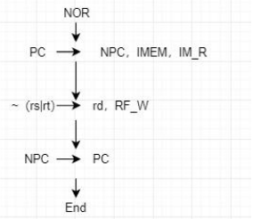

数据通路图：\
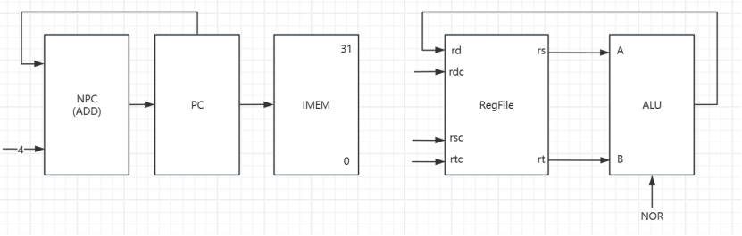

9.SLT(set less than)\
格式：SLT rd,rs,rt\
目的：通过小于的比较来记录结果\
描述：rd←(rs < rt)\
比较在rs和rt寄存器中保存的有符号数，用boolean值保存结果到rd寄存器中。如果rs小于rt，则结果为1，反之结果为0。算数比较不会引起溢出异常。\
操作：rd←(rs < rt),PC←NPC(PC+4)\
所需部件：PC、NPC、IMEM、Regfile、ALU、EXT1。\
指令周期：\
·取指周期：\
PC→IMEM\
PC+4→NPC\
NPC→PC\
·执行周期：\
rs→A,rt→B\
(A - B→result)\
SF→EXT1//1位拓展到32位\
EXT1_OUT→rd\
指令流程图：\
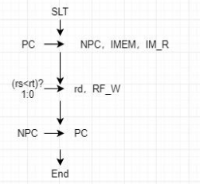

数据通路图：\
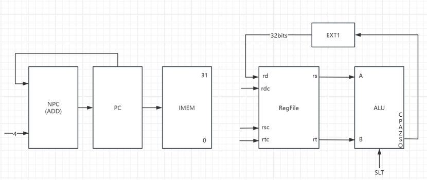

10.SLTU\
格式：SLTU rd,rs,rt\
目的：通过小于的比较来记录结果\
描述：rd←(rs < rt)\
比较在rs和rt寄存器中保存的无符号数，用boolean值保存结果到rd寄存器中。如果rs小于rt，则结果为1，反之结果为0。算数比较不会引起溢出异常。\
操作：rd←(rs < rt),PC←NPC(PC+4)\
所需部件：PC、NPC、IMEM、Regfile、ALU、EXT1。\
指令周期：\
·取指周期：\
PC→IMEM\
PC+4→NPC\
NPC→PC\
·执行周期：\
rs→A,rt→B\
(A - B→result)\
SF→EXT1//1位拓展到32位\
EXT1_OUT→rd\
指令流程图：\
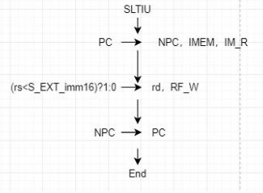

数据通路图：\
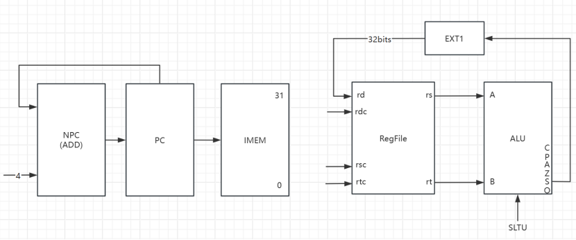

11.SLL(shift left logical)\
格式：SLL rd,rt,sa\
目的：通过数字0填充逻辑左移\
描述：rd←rt<<sa\
将通用寄存器rt的内容左移sa位，空余出来的位置用0来填充，把结果存入rd寄存器\
操作：rd←rt< <sa,PC←NPC(PC+4)\
所需部件：PC、NPC、IMEM、Regfile、ALU、EXT5。\
指令周期：\
·取指周期：\
PC→IMEM\
PC+4→NPC\
NPC→PC\
·执行周期：\
IMEM[10:6]→EXT5\
EXT5_OUT→A\
rt→B\
(B << A→result)\
result→rd\
指令流程图：\
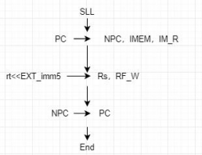

数据通路图：\
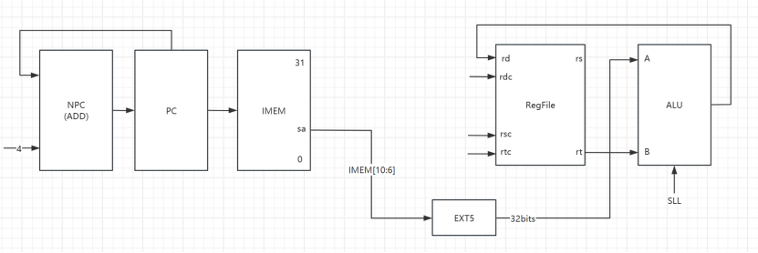

12.SRL(shift right logical)\
格式：SRL rd,rt,sa\
目的：通过数字0填充逻辑右移\
描述：rd←rt>>sa\
将通用寄存器rt的内容右移sa位，空余出来的位置用0来填充，把结果存入rd寄存器\
操作：rd←rt>>sa,PC←NPC(PC+4)\
所需部件：PC、NPC、IMEM、Regfile、ALU、EXT5。\
指令周期：\
·取指周期：\
PC→IMEM\
PC+4→NPC\
NPC→PC\
·执行周期：\
IMEM[10:6]→EXT5\
EXT5_OUT→A\
rt→B\
(B >> A→result)\
result→rd\
指令流程图：\
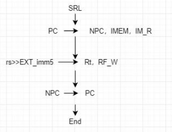

数据通路图：\
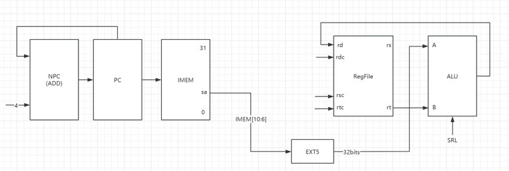

13.SRA(shift right arithmetic)\
格式：SRA rd,rt,sa\
目的：通过数字填充算术右移\
描述：rd←rt>>sa\
将通用寄存器rt的32位内容右移sa位，高位用rt[31]来填充，结果存入通用寄存器rd。\
操作：rd←rt>>sa,PC←NPC(PC+4)\
所需部件：PC、NPC、IMEM、Regfile、ALU、EXT5。\
指令周期：\
·取指周期：\
PC→IMEM\
PC+4→NPC\
NPC→PC\
·执行周期：\
IMEM[10:6]→EXT5\
EXT5_OUT→A\
rt→B\
(B >> A→result)\
result→rd\
指令流程图：\
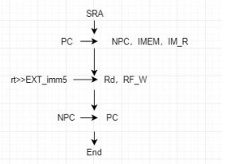

数据通路图：\
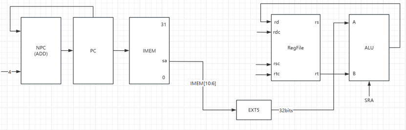

14.SLLV(shift left logic variable)\
格式：SLLV rd,rt,rs\
目的：通过数字0填充逻辑左移\
描述：rd←rt<<rs\
将通用寄存器rt中的内容逻辑左移，左移的位数保存在rs寄存器中，空余出来的位置用0来填充，把结果存入rd寄存器。\
操作：rd←rt<<rs,PC←NPC(PC+4)\
所需部件：PC、NPC、IMEM、Regfile、ALU、EXT5。\
指令周期：\
·取指周期：\
PC→IMEM\
PC+4→NPC\
NPC→PC\
·执行周期：\
rs[4:0]→EXT5\
EXT5_OUT→A\
rt→B\
(B << A→result)\
result→rd\
指令流程图：\
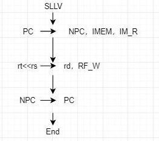

数据通路图：\
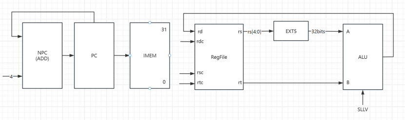

15.SRLV(shift right logic variable)\
格式：SRLV rd,rt,rs\
目的：通过数字0填充逻辑右移\
描述：rd←rt>>rs\
将通用寄存器rt中的32位内容右移，高位用rt[31]来填充，结果存入通用寄存器rd。右移的位数由通用寄存器rs中的0~4bit确定\
操作：rd←rt>>rs,PC←NPC(PC+4)\
所需部件：PC、NPC、IMEM、Regfile、ALU、EXT5。\
指令周期：\
·取指周期：\
PC→IMEM\
PC+4→NPC\
NPC→PC\
·执行周期：\
rs[4:0]→EXT5\
EXT5_OUT→A\
rt→B\
(B >> A→result)\
result→rd\
指令流程图：\
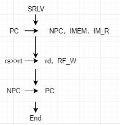

数据通路图：\
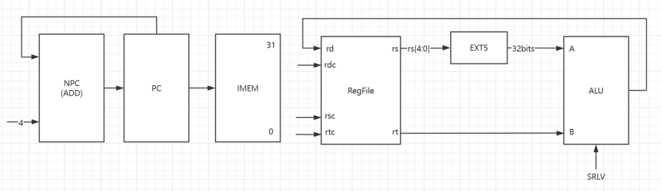

16.SRAV(shift right arithmetic variable)\
格式：SRAV rd,rt,rs\
目的：通过数字填充算术右移\
描述：rd←rt>>rs\
将通用寄存器rt中的32位内容右移，高位用rt[31]来填充，结果存入通用寄存器rd。右移的位数由通用寄存器rs中的0~4bit确定\
操作：rd←rt>>rs,PC←NPC(PC+4)\
所需部件：PC、NPC、IMEM、Regfile、ALU、EXT5。\
指令周期：\
·取指周期：\
PC→IMEM\
PC+4→NPC\
NPC→PC\
·执行周期：\
rs[4:0]→EXT5\
EXT5_OUT→A\
rt→B\
(B >> A→result)\
result→rd\
指令流程图：\
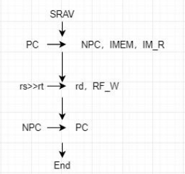

数据通路图：\
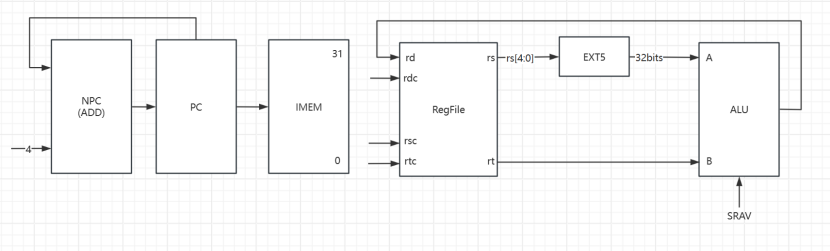

17.JR(jump register)\
格式：JR rs\
目的：使用寄存器的跳转指令\
描述：PC←rs\
跳转地址存放在通用寄存器rs中，直接跳转到寄存器所存地址。\
操作：rd←rt>>rs,PC←NPC(PC+4)\
所需部件：PC、NPC、IMEM、Regfile、ALU、EXT5。\
指令周期：\
PC→IMEM\
PC+4→NPC\
NPC→MUX\
rs→MUX//多路选择器，选择rs的地址或NPC的地址\
MUX_OUT→PC\
指令流程图：\
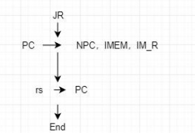

数据通路图：\
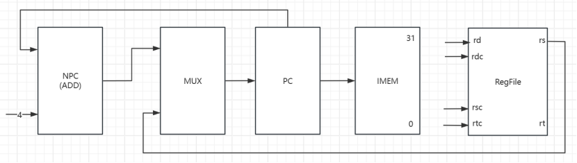

### I-type

18.ADDI\
格式：ADDI rd,rs,immediate\
目的：使32位数据与一个立即数相加\
描述：rd←rs+immediate\
一个16位有符号的立即数与通用寄存器rs中的32位数相加产生一个32位的数存入目标寄存器rd。\
（1）如果发生了溢出，则rd不改变且产生一个溢出的异常\
（2）如果相加不溢出，则结果存入目标寄存器rd。\
操作：rd←rs+immediate,PC←NPC(PC+4)\
所需部件：PC、NPC、IMEM、Regfile、ALU、EXT16。\
指令周期：\
·取指周期：\
PC→IMEM\
PC+4→NPC\
NPC→PC\
·执行周期：\
IMEM[15:0]→EXT16\
EXT16_OUT→B\
rs→A\
(A+B→result)\
result→rd\
指令流程图：\
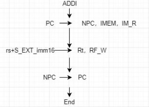

数据通路图：\
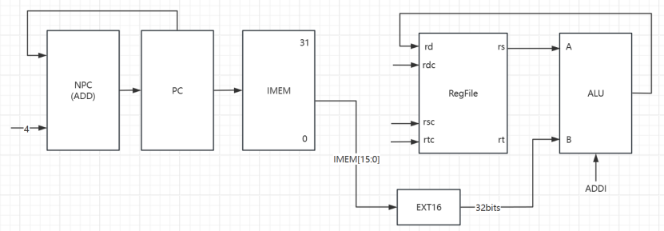

19.ADDIU\
格式：ADDIU rd,rs,immediate\
目的：使32位数据与一个立即数相加\
描述：rd←rs+immediate\
一个16位有符号的立即数与通用寄存器rs中的32位数相加产生一个32位的数存入目标寄存器rd。\
在任何情况下都不会有溢出的异常\
操作：rd←rs+immediate,PC←NPC(PC+4)\
所需部件：PC、NPC、IMEM、Regfile、ALU、EXT16。\
指令周期：\
·取指周期：\
PC→IMEM\
PC+4→NPC\
NPC→PC\
·执行周期：\
IMEM[15:0]→EXT16\
EXT16_OUT→B\
rs→A\
(A+B→result)\
result→rd\
指令流程图：\
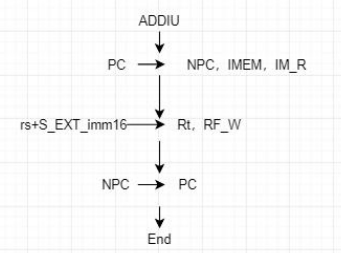

数据通路图：\
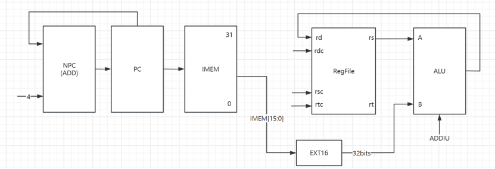

20.ANDI\
格式：ANDI,rd,rs,immediate\
目的：与一个常数做按位逻辑与。\
描述：rd←rs AND immediate\
将16位立即数做0扩展后与通用寄存器rs中的32位数据做按位与，将结果存入目标寄存器rd\
操作：rd←rs ANDI immediate,PC←NPC(PC+4)\
所需部件：PC、NPC、IMEM、Regfile、ALU。\
指令周期：\
·取指周期：\
PC→IMEM\
PC+4→NPC\
NPC→PC\
·执行周期：\
IMEM[15:0]→EXT16\
EXT16_OUT→B\
rs→A\
(A&B→result)\
result→rd\
指令流程图：\
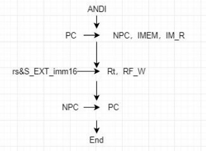

数据通路图：\
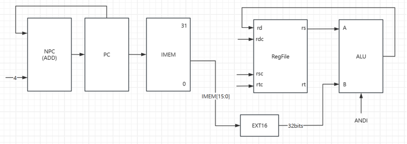

21.ORI\
格式：ORI,rd,rs,immediate\
目的：与一个常数做按位逻辑或。\
描述：rd←rs ORI immediate\
将16位立即数做0扩展后与通用寄存器rs中的32位数据做按位或，将结果存入目标寄存器rd\
操作：rd←rs ORI immediate,PC←NPC(PC+4)\
所需部件：PC、NPC、IMEM、Regfile、ALU。\
指令周期：\
·取指周期：\
PC→IMEM\
PC+4→NPC\
NPC→PC\
·执行周期：\
IMEM[15:0]→EXT16\
EXT16_OUT→B\
rs→A\
(A|B→result)\
result→rd\
指令流程图：\
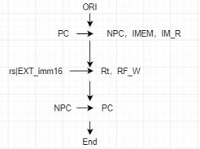

数据通路图：\
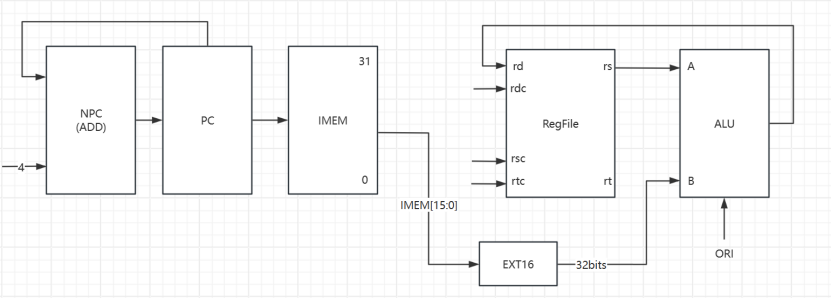

22.XORI\
格式：ORI,rd,rs,immediate\
目的：与一个常数做按位逻辑异或。\
描述：rd←rs XORI immediate\
将16位立即数做0扩展后与通用寄存器rs中的32位数据做按位异或，将结果存入目标寄存器rd\
操作：rd←rs XORI immediate,PC←NPC(PC+4)\
所需部件：PC、NPC、IMEM、Regfile、ALU、EXT16。\
指令周期：\
·取指周期：\
PC→IMEM\
PC+4→NPC\
NPC→PC\
·执行周期：\
IMEM[15:0]→EXT16\
EXT16_OUT→B\
rs→A\
(A^B→result)\
result→rd\
指令流程图：\
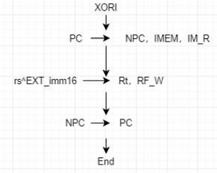

数据通路图：\
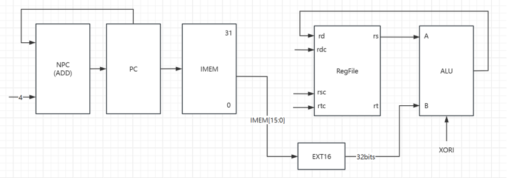

23.LW(Load Word)\
格式：LW rd,offset(base)\
目的：从内存读取一个字的有符号数据。\
描述：rd←memory[base + offset]\
从内存中基地址加偏移量所得到的准确地址中的内容加载到通用寄存器rd中。\
操作：rd←memory[base + offset],PC←NPC(PC+4)\
所需部件：PC、NPC、IMEM、Regfile、ALU、EXT16。\
指令周期：\
·取指周期：\
PC→IMEM\
PC+4→NPC\
NPC→PC\
·执行周期：\
IMEM[15:0]→EXT16\
EXT16_OUT→B\
rs→A\
(A + B→result)\
result→DMEM_ADDR\
DMEM_OUT→rd\
指令流程图：\
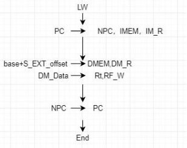

数据通路图：\
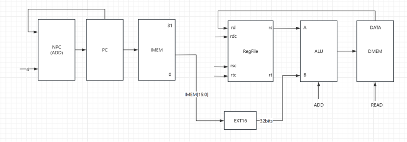

24.SW(Store Word)\
格式：SW rt,offset(base)\
目的：存一个字到内存。\
描述：memory[base + offset]←rt\
将通用寄存器rt中的32位数据存入内存中的有效地址，有效地址由基地址和16位偏移量相加所得。\
操作：memory[base + offset]←rt,PC←NPC(PC+4)\
所需部件：PC、NPC、IMEM、Regfile、ALU、EXT16。\
指令周期：\
·取指周期：\
PC→IMEM\
PC+4→NPC\
NPC→PC\
·执行周期：\
IMEM[15:0]→EXT16\
EXT16_OUT→B\
rs→A\
(A + B→result)\
Rt→DMEM\
result→DMEM_ADDR\
指令流程图：\
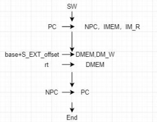

数据通路图：\
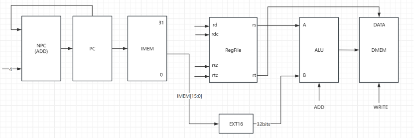

25.BEQ(Branch if Equal)\
格式：BEQ rs,rt,offset\
目的：比较通用寄存器的值，然后做PC相关的分支跳转\
描述：如果rs=rt，那么将offset左移两位（乘以4，因为每条指令的长度是4字节），再进行符号扩展到32位与当前pc相加，形成有效转移地址，转到该地址\
如果rs!=rt，则继续执行下条指令。\
操作：将rs与rt相减，若结果为0则跳转，否则不跳转。\
所需部件：PC、NPC、IMEM、Regfile、ALU、EXT18、MUX。\
指令周期：\
PC→IMEM\
PC+4→NPC\
NPC→MUX\
IMEM[15:0]||02→EXT18\
EXT18_OUT→ADD_A\
NPC→ADD_B\
(ADD_A+ADD_B→ADD_OUT)\
ADD_OUT→MUX\
rs→A\
rt→B\
(A-B→result)\
Z→MUX\
MUX→PC\
指令流程图：\
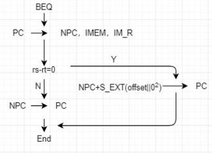

数据通路图：\


26.BNE(Branch if not Equal)\
格式：BNE rs,rt,offset\
目的：比较通用寄存器的值，然后做PC相关的分支跳转\
描述：如果rs!=rt，那么将offset左移两位（乘以4，因为每条指令的长度是4字节），再进行符号扩展到32位与当前pc相加，形成有效转移地址，转到该地址\
如果rs=rt，则继续执行下条指令。\
操作：将rs与rt相减，若结果不为0则跳转，否则不跳转。\
所需部件：PC、NPC、IMEM、Regfile、ALU、EXT18、MUX。\
指令周期：\
PC→IMEM\
PC+4→NPC\
NPC→MUX\
IMEM[15:0]||02→EXT18\
EXT18_OUT→ADD_A\
NPC→ADD_B\
(ADD_A+ADD_B→ADD_OUT)\
ADD_OUT→MUX\
rs→A\
rt→B\
(A-B→result)\
Z→MUX\
MUX→PC\
指令流程图：\


数据通路图：\


27.SLTI(Set on Less Than Immediate)\
格式：SLTI rd,rs,rt\
目的：比通过跟立即数小于的比较来记录结果。\
描述：rd←(rs < rt)\
比较在rs和rt寄存器中保存的有符号数，用boolean值保存结果到rd寄存器中。如过rs小于rt，则结果为1，反之结果为0,。算术比较不会引起溢出异常。\
操作：rd←(rs < rt),PC←NPC(PC+4)\
所需部件：PC、NPC、IMEM、Regfile、ALU、EXT1。\
指令周期：\
·取指周期：\
PC→IMEM\
PC+4→NPC\
NPC→PC\
·执行周期：\
IMEM[15:0]→EXT16\
EXT16_OUT→B\
rs→A\
(A-B→result)\
CF→EXT1\
EXT1_OUT→rd\
指令流程图：\


数据通路图：\


28.SLTIU\
格式：SLTIU rd,rs,rt\
目的：比通过跟立即数无符号小于的比较来记录结果。\
描述：rd←(rs < rt)\
比较在rs和rt寄存器中保存的无符号数，用boolean值保存结果到rd寄存器中。如过rs小于rt，则结果为1，反之结果为0,。算术比较不会引起溢出异常。\
操作：rd←(rs < rt),PC←NPC(PC+4)\
所需部件：PC、NPC、IMEM、Regfile、ALU、EXT1。\
指令周期：\
·取指周期：\
PC→IMEM\
PC+4→NPC\
NPC→PC\
·执行周期：\
IMEM[15:0]→EXT16\
EXT16_OUT→B\
rs→A\
(A-B→result)\
CF→EXT1\
EXT1_OUT→rd\
指令流程图：\


数据通路图：\


29.LUI(Load unsigned Immediate)\
格式：LUI rt,immediate\
目的：把一个立即数载入到寄存器的高位，低位补0.\
描述：rt←immediate||016\
将一个16位的立即数载入到通用寄存器rt的高位，低16位补0。\
操作：rt←immediate||016,PC←NPC(PC+4)\
所需部件：PC、NPC、IMEM、Regfile、ALU、EXT16。\
指令周期：\
·取指周期：\
PC→IMEM\
PC+4→NPC\
NPC→PC\
·执行周期：\
IMEM[15:0]→EXT16\
EXT16_OUT→B\
result→rd\
指令流程图：\


数据通路图：\


### J-type

30.J(Jump)\
格式：J target\
目的：在256MB的范围内跳转。\
描述：该指令无条件跳转到一个绝对地址，instr_index有26位，在左移后访问空间能达到228B,即256MB。\
操作：PC←NPC(target)\
所需部件：PC、NPC、IMEM、MUX、||。\
指令周期：\
PC→IMEM\
PC+4→NPC\
NPC→MUX\
\
PC[31:28]→||_A\
IMEM[25:0]||02→||_B\
IMEM[15:0]→EXT16\
||_OUT→MUX\
\
MUX_OUT→PC\
指令流程图：\


数据通路图：\


31.JAL(Jump)\
格式：JAL target\
目的：在256MB的范围内执行一个过程调用。\
描述：在跳转到知道地址执行子程序调用的同时，在31号寄存器中存放返回地址（当前地址后的第二条指令地址）\
操作：rd←NPC(PC+8),PC←NPC(target)\
所需部件：PC、NPC、IMEM、MUX、||、Regfile、ALU。\
指令周期：\
PC→IMEM\
PC+4→NPC\
NPC→MUX\
\
8→A\
PC→B\
(A+B→result)\
result→rd\
\
PC[31:28]→||_A\
IMEM[25:0]||02→||_B\
IMEM[15:0]→EXT16\
||_OUT→MUX\
\
MUX_OUT→PC\
指令流程图：\


数据通路图：\


## 4.数据通路总图

接下来，将上述31条指令的数据通路图合在一起，形成数据通路总图


注意，在绘制数据通路总图时，要按照指令顺序依次画，最好同类型指令用同样的颜色标识，方便后期查错。

## 5.控制部件设计

将每条指令对应的所有控制信号列出，有了数据通路图，指令表就非常好写了。我们需要做的是在表中列出每一条指令和图中涉及到的所有操作信号，根据你列出的
通路图和每条指令涉及到的操作，将每条指令对应的操作信号标注出来。

这部分内容对应的是control.v中的代码。

## 6.代码编写

### 控制器Controler

用于控制运行指令时每个元件的状态。

```verilog
`timescale 1ns / 1ps
/* 控制器 */
module Controler(              //根据当前要执行的指令输出各个元器件的状态
    input add_flag,            //指令是否为ADD
    input addu_flag,           //指令是否为ADDU
    input sub_flag,            //指令是否为SUB
    input subu_flag,           //指令是否为SUBU
    input and_flag,            //指令是否为AND
    input or_flag,             //指令是否为OR
    input xor_flag,            //指令是否为XOR
    input nor_flag,            //指令是否为NOR
    input slt_flag,            //指令是否为SLT
    input sltu_flag,           //指令是否为SLTU
    input sll_flag,            //指令是否为SLL
    input srl_flag,            //指令是否为SRL
    input sra_flag,            //指令是否为SRA
    input sllv_flag,           //指令是否为SLLV
    input srlv_flag,           //指令是否为SRLV
    input srav_flag,           //指令是否为SRAV
    input jr_flag,             //指令是否为JR
    input addi_flag,           //指令是否为ADDI
    input addiu_flag,          //指令是否为ADDIU
    input andi_flag,           //指令是否为ANDI
    input ori_flag,            //指令是否为ORI
    input xori_flag,           //指令是否为XORI
    input lw_flag,             //指令是否为LW
    input sw_flag,             //指令是否为SW
    input beq_flag,            //指令是否为BEQ
    input bne_flag,            //指令是否为BNE
    input slti_flag,           //指令是否为SLTI
    input sltiu_flag,          //指令是否为SLTIU
    input lui_flag,            //指令是否为LUI
    input j_flag,              //指令是否为J
    input jal_flag,            //指令是否为JAL
    input zero,                //ALU标志位ZF
    /* 所有用到的元件和指令这里都会涉及到 */
    output reg_w,              //RegFile寄存器堆是否可写入
    output [3:0] aluc,         //ALUC的指令，决定ALUC执行何种操作
    output dm_r,               //DMEM是否可写入
    output dm_w,               //是否从DMEM中读取数据
    output [4:0] ext_ena,      //EXT扩展是否开启，5个状态分别对应EXT1、EXT5、EXT16、EXT16(S)、EXT18(S),其中EXT[0]对应EXT1
    output cat_ena,            //是否需要拼接
    output [10:0] mux           //10个多路选择器的状态（选择0还是选择1）(0没用到，为了使MUX编号和数组下标对应所以多一个)
    );
/* 下面是赋值，也就是根据要执行的操作决定各元器件的状态 */
assign reg_w = (!jr_flag && !sw_flag && !beq_flag && !bne_flag && !j_flag) ? 1'b1 : 1'b0;

assign aluc[3] = (slt_flag  || sltu_flag  || sllv_flag || srlv_flag ||
                  srav_flag || sll_flag   || srl_flag  || sra_flag  || 
                  slti_flag || sltiu_flag || lui_flag) ? 1'b1 : 1'b0;
assign aluc[2] = (and_flag  || or_flag    || xor_flag  || nor_flag  ||
                  sllv_flag || srlv_flag  || srav_flag || sll_flag  ||
                  srl_flag  || sra_flag   || andi_flag || ori_flag  ||
                  xori_flag) ? 1'b1 : 1'b0;
assign aluc[1] = (add_flag  || sub_flag   || xor_flag  || nor_flag  ||
                  slt_flag  || sltu_flag  || sllv_flag || sll_flag  ||
                  addi_flag || xori_flag  || slti_flag || sltiu_flag) ? 1'b1 : 1'b0;
assign aluc[0] = (sub_flag  || subu_flag  || or_flag   || nor_flag  ||
                  slt_flag  || sllv_flag  || srlv_flag || sll_flag  ||
                  srl_flag  || ori_flag   || slti_flag || lui_flag  ||
                  beq_flag  || bne_flag) ? 1'b1 : 1'b0;
//aluc[0]中SLLV、SLL、LUI加不加均可

assign dm_r = lw_flag ? 1'b1 : 1'b0;
assign dm_w = sw_flag ? 1'b1 : 1'b0;

assign ext_ena[4] = (beq_flag  || bne_flag) ? 1'b1 : 1'b0;                              //EXT18(S)
assign ext_ena[3] = (addi_flag || addiu_flag || lw_flag   || sw_flag ||
                     slti_flag || sltiu_flag) ? 1'b1 : 1'b0;                            //EXT16(S)
assign ext_ena[2] = (andi_flag || ori_flag   || xori_flag || lui_flag) ? 1'b1 : 1'b0;   //EXT16
assign ext_ena[1] = (sll_flag  || srl_flag   || sra_flag) ? 1'b1 : 1'b0;                //EXT5
assign ext_ena[0] = (slt_flag  || sltu_flag  || slti_flag || sltiu_flag) ? 1'b1 : 1'b0; //EXT1

assign cat_ena = (j_flag || jal_flag) ? 1'b1 : 1'b0;
assign mux[10]= (sll_flag   || srl_flag   || sra_flag) ? 1'b1 : 1'b0;
assign mux[9] = (add_flag   || addu_flag  || sub_flag  || subu_flag  ||
                 and_flag   || or_flag    || xor_flag  || nor_flag   ||
                 sll_flag   || srl_flag   || sra_flag  || sllv_flag  ||
                 srlv_flag  || srav_flag  || lui_flag  || addi_flag  || 
                 addiu_flag || andi_flag  || ori_flag  || xori_flag) ? 1'b1 : 1'b0;
assign mux[8] = (addi_flag  || addiu_flag || lw_flag   || sw_flag    ||
                 slti_flag  || sltiu_flag) ? 1'b1 : 1'b0;
assign mux[7] = jal_flag ? 1'b1 : 1'b0;
assign mux[6] = beq_flag ? ~zero : (bne_flag ? zero : 1'b1);
assign mux[5] = (addi_flag  || addiu_flag || andi_flag || ori_flag  ||
                 xori_flag  || lw_flag    || sw_flag   || slti_flag ||
                 sltiu_flag || lui_flag) ? 1'b1 : 1'b0;
assign mux[4] = (!jr_flag && !j_flag && !jal_flag) ? 1'b1 : 1'b0;
assign mux[3] = (sll_flag   || srl_flag   || sra_flag || sllv_flag || srlv_flag || srav_flag) ? 1'b1 : 1'b0;
assign mux[2] = !lw_flag ? 1'b1 : 1'b0;
assign mux[1] = (j_flag || jal_flag) ? 1'b1 : 1'b0;

endmodule

```

### 译码器Decoder

将指令码转化为控制信号输出。

```verilog
`timescale 1ns / 1ps
/* 译码器 */
module Decoder(                 //所有接口如果当前译码出的指令不需要，置为高阻抗
    input  [31:0] instr_in,     //需要译码的指令，也就是当前要执行的指令
    output add_flag,            //指令是否为ADD
    output addu_flag,           //指令是否为ADDU
    output sub_flag,            //指令是否为SUB
    output subu_flag,           //指令是否为SUBU
    output and_flag,            //指令是否为AND
    output or_flag,             //指令是否为OR
    output xor_flag,            //指令是否为XOR
    output nor_flag,            //指令是否为NOR
    output slt_flag,            //指令是否为SLT
    output sltu_flag,           //指令是否为SLTU
    output sll_flag,            //指令是否为SLL
    output srl_flag,            //指令是否为SRL
    output sra_flag,            //指令是否为SRA
    output sllv_flag,           //指令是否为SLLV
    output srlv_flag,           //指令是否为SRLV
    output srav_flag,           //指令是否为SRAV
    output jr_flag,             //指令是否为JR
    output addi_flag,           //指令是否为ADDI
    output addiu_flag,          //指令是否为ADDIU
    output andi_flag,           //指令是否为ANDI
    output ori_flag,            //指令是否为ORI
    output xori_flag,           //指令是否为XORI
    output lw_flag,             //指令是否为LW
    output sw_flag,             //指令是否为SW
    output beq_flag,            //指令是否为BEQ
    output bne_flag,            //指令是否为BNE
    output slti_flag,           //指令是否为SLTI
    output sltiu_flag,          //指令是否为SLTIU
    output lui_flag,            //指令是否为LUI
    output j_flag,              //指令是否为J
    output jal_flag,            //指令是否为JAL
    output [4:0]  RsC,          //Rs对应的寄存器的地址
    output [4:0]  RtC,          //Rt对应的寄存器的地址
    output [4:0]  RdC,          //Rd对应的寄存器的地址
    output [4:0]  shamt,        //位移偏移量（SLL，SRL，SRA用）
    output [15:0] immediate,    //立即数（I型指令用）
    output [25:0] address       //跳转地址（J型指令用）
    );
/* 定义各指令在原指令中对应的编码 */
/* 下面这些指令经过了扩展，OP段全为0，需要额外的6位FUNC加以区分 */
parameter ADD_OPE   = 6'b100000;
parameter ADDU_OPE  = 6'b100001;
parameter SUB_OPE   = 6'b100010;
parameter SUBU_OPE  = 6'b100011;
parameter AND_OPE   = 6'b100100;
parameter OR_OPE    = 6'b100101;
parameter XOR_OPE   = 6'b100110;
parameter NOR_OPE   = 6'b100111;
parameter SLT_OPE   = 6'b101010;
parameter SLTU_OPE  = 6'b101011;

parameter SLL_OPE   = 6'b000000;
parameter SRL_OPE   = 6'b000010;
parameter SRA_OPE   = 6'b000011;

parameter SLLV_OPE  = 6'b000100;
parameter SRLV_OPE  = 6'b000110;
parameter SRAV_OPE  = 6'b000111;

parameter JR_OPE    = 6'b001000;
/* 下面这些指令通过OP段直接加以区分 */
parameter ADDI_OPE  = 6'b001000;
parameter ADDIU_OPE = 6'b001001;
parameter ANDI_OPE  = 6'b001100;
parameter ORI_OPE   = 6'b001101;
parameter XORI_OPE  = 6'b001110;
parameter LW_OPE    = 6'b100011;
parameter SW_OPE    = 6'b101011;
parameter BEQ_OPE   = 6'b000100;
parameter BNE_OPE   = 6'b000101;
parameter SLTI_OPE  = 6'b001010;
parameter SLTIU_OPE = 6'b001011;

parameter LUI_OPE   = 6'b001111;

parameter J_OPE     = 6'b000010;
parameter JAL_OPE   = 6'b000011;

/* 下面是赋值 */
/* 对指令进行译码，判断是哪个指令 */
assign add_flag  = ((instr_in[31:26] == 6'h0) && (instr_in[5:0] == ADD_OPE )) ? 1'b1 : 1'b0;
assign addu_flag = ((instr_in[31:26] == 6'h0) && (instr_in[5:0] == ADDU_OPE)) ? 1'b1 : 1'b0;
assign sub_flag  = ((instr_in[31:26] == 6'h0) && (instr_in[5:0] == SUB_OPE )) ? 1'b1 : 1'b0;
assign subu_flag = ((instr_in[31:26] == 6'h0) && (instr_in[5:0] == SUBU_OPE)) ? 1'b1 : 1'b0;
assign and_flag  = ((instr_in[31:26] == 6'h0) && (instr_in[5:0] == AND_OPE )) ? 1'b1 : 1'b0;
assign or_flag   = ((instr_in[31:26] == 6'h0) && (instr_in[5:0] == OR_OPE  )) ? 1'b1 : 1'b0;
assign xor_flag  = ((instr_in[31:26] == 6'h0) && (instr_in[5:0] == XOR_OPE )) ? 1'b1 : 1'b0;
assign nor_flag  = ((instr_in[31:26] == 6'h0) && (instr_in[5:0] == NOR_OPE )) ? 1'b1 : 1'b0;
assign slt_flag  = ((instr_in[31:26] == 6'h0) && (instr_in[5:0] == SLT_OPE )) ? 1'b1 : 1'b0;
assign sltu_flag = ((instr_in[31:26] == 6'h0) && (instr_in[5:0] == SLTU_OPE)) ? 1'b1 : 1'b0;

assign sll_flag  = ((instr_in[31:26] == 6'h0) && (instr_in[5:0] == SLL_OPE )) ? 1'b1 : 1'b0;
assign srl_flag  = ((instr_in[31:26] == 6'h0) && (instr_in[5:0] == SRL_OPE )) ? 1'b1 : 1'b0;
assign sra_flag  = ((instr_in[31:26] == 6'h0) && (instr_in[5:0] == SRA_OPE )) ? 1'b1 : 1'b0;

assign sllv_flag = ((instr_in[31:26] == 6'h0) && (instr_in[5:0] == SLLV_OPE)) ? 1'b1 : 1'b0;
assign srlv_flag = ((instr_in[31:26] == 6'h0) && (instr_in[5:0] == SRLV_OPE)) ? 1'b1 : 1'b0;
assign srav_flag = ((instr_in[31:26] == 6'h0) && (instr_in[5:0] == SRAV_OPE)) ? 1'b1 : 1'b0;
assign jr_flag   = ((instr_in[31:26] == 6'h0) && (instr_in[5:0] == JR_OPE  )) ? 1'b1 : 1'b0;

assign addi_flag  = (instr_in[31:26] == ADDI_OPE ) ? 1'b1 : 1'b0;
assign addiu_flag = (instr_in[31:26] == ADDIU_OPE) ? 1'b1 : 1'b0;
assign andi_flag  = (instr_in[31:26] == ANDI_OPE ) ? 1'b1 : 1'b0;
assign ori_flag   = (instr_in[31:26] == ORI_OPE  ) ? 1'b1 : 1'b0;
assign xori_flag  = (instr_in[31:26] == XORI_OPE ) ? 1'b1 : 1'b0;
assign lw_flag    = (instr_in[31:26] == LW_OPE   ) ? 1'b1 : 1'b0;
assign sw_flag    = (instr_in[31:26] == SW_OPE   ) ? 1'b1 : 1'b0;
assign beq_flag   = (instr_in[31:26] == BEQ_OPE  ) ? 1'b1 : 1'b0;
assign bne_flag   = (instr_in[31:26] == BNE_OPE  ) ? 1'b1 : 1'b0;
assign slti_flag  = (instr_in[31:26] == SLTI_OPE ) ? 1'b1 : 1'b0;
assign sltiu_flag = (instr_in[31:26] == SLTIU_OPE) ? 1'b1 : 1'b0;

assign lui_flag   = (instr_in[31:26] == LUI_OPE  ) ? 1'b1 : 1'b0;

assign j_flag     = (instr_in[31:26] == J_OPE    ) ? 1'b1 : 1'b0;
assign jal_flag   = (instr_in[31:26] == JAL_OPE  ) ? 1'b1 : 1'b0;

/* 取出指令中各部分的值 */
assign RsC = (add_flag  || addu_flag || sub_flag  || subu_flag  ||
              and_flag  || or_flag   || xor_flag  || nor_flag   ||
              slt_flag  || sltu_flag || sllv_flag || srlv_flag  ||
              srav_flag || jr_flag   || addi_flag || addiu_flag ||
              andi_flag || ori_flag  || xori_flag || lw_flag    ||
              sw_flag   || beq_flag  || bne_flag  || slti_flag  ||
              sltiu_flag) ? instr_in[25:21] : 5'hz;

assign RtC = (add_flag  || addu_flag  || sub_flag   || subu_flag ||
              and_flag  || or_flag    || xor_flag   || nor_flag  ||
              slt_flag  || sltu_flag  || sll_flag   || srl_flag  ||
              sra_flag  || sllv_flag  || srlv_flag  || srav_flag ||
              sw_flag   || beq_flag   || bne_flag ) ? instr_in[20:16] : 5'hz;

assign RdC = (add_flag  || addu_flag  || sub_flag  || subu_flag  ||
              and_flag  || or_flag    || xor_flag  || nor_flag   ||
              slt_flag  || sltu_flag  || sll_flag  || srl_flag   ||
              sra_flag  || sllv_flag  || srlv_flag || srav_flag) ? instr_in[15:11] : ((
              addi_flag || addiu_flag || andi_flag || ori_flag   || 
              xori_flag || lw_flag    || slti_flag || sltiu_flag ||
              lui_flag) ? instr_in[20:16] : (jal_flag ? 5'd31 : 5'hz));

assign shamt = (sll_flag || srl_flag || sra_flag) ? instr_in[10:6] : 5'hz;        

assign immediate = (addi_flag || addiu_flag || andi_flag  || ori_flag || 
                    xori_flag || lw_flag    || sw_flag    || beq_flag || 
                    bne_flag  || slti_flag  || sltiu_flag || lui_flag) ? instr_in[15:0] : 16'hz;

assign address = (j_flag || jal_flag) ? instr_in[25:0] : 26'hz;     

endmodule

```

### 算术逻辑单元ALU

完成各种算术和逻辑运算

```verilog
`timescale 1ns / 1ps
/* 算术逻辑单元 */
module ALU(
    input  [3:0] ALU_C,          //操作指令
    input  [31:0] A,             //接口A
    input  [31:0] B,             //接口B
    output [31:0] OUT,           //运算结果
    /* 运算标志位 */
    output CF,
    output ZF,
    output SF,
    output OF
    );
    /* 定义各指令对应的操作 */
    parameter ADD  = 4'b0000;//有符号加
    parameter ADDU = 4'b0010;//无符号加
    parameter SUB  = 4'b0001;//有符号键
    parameter SUBU = 4'b0011;//无符号减
    parameter AND  = 4'b0100;//按位与
    parameter OR   = 4'b0101;//按位或
    parameter XOR  = 4'b0110;//按位异或
    parameter NOR  = 4'b0111;//安慰或非
    parameter LUI  = 4'b100x;//加载无符号立即数
    parameter SLT  = 4'b1011;//小于
    parameter SLTU = 4'b1010;//无符号小于
    parameter SRA  = 4'b1100;//算术右移
    parameter SLL  = 4'b111x;//逻辑右移
    parameter SLA  = 4'b111x;//算术左移
    parameter SRL  = 4'b1101;//逻辑左移
    /* 定义一些内部用的变量 */
    reg [32:0] result;          //存储结果，result[32]为进位判断
    wire signed [31:0] s_A,s_B; //有符号数
    assign s_A = A;
    assign s_B = B;
    
    always @(*)
    begin
        case(ALU_C)
            ADD:        begin result <= s_A + s_B;                      end 
            ADDU:       begin result <= A + B;                          end
            SUB:        begin result <= s_A - s_B;                      end
            SUBU:       begin result <= A - B;                          end
            AND:        begin result <= A & B;                          end
            OR:         begin result <= A | B;                          end
            XOR:        begin result <= A ^ B;                          end
            NOR:        begin result <= ~(A | B);                       end
            LUI:        begin result <= { B[15:0] , 16'b0 };            end
            SLT:        begin result <= s_A - s_B;                      end
            SLTU:       begin result <= A - B;                          end
            SRA:        begin result <= s_B >>> s_A;                    end
            SLL,SLA:    begin result <= B << A;                         end
            SRL:        begin result <= B >> A;                         end
        endcase
    end 
    
    assign OUT = result[31:0];              //运算结果
    assign CF =  result[32];                //进位标志位
    assign ZF = (result == 32'b0) ? 1 : 0;  //0标志位
    assign SF = (ALU_C == SLT ? (s_A < s_B)://有符号数比较
                 ((ALU_C == SLTU) ? (A < B)://无符号数比较
                                     1'b0));//0
    assign OF = result[32];                 //溢出标志位
endmodule

```

### 寄存器堆Regfile

32位的寄存器堆

```verilog
`timescale 1ns / 1ps
/* 寄存器堆 */
module regfile(               
    input  reg_clk,      //时钟 
    input  reg_ena,      //使能     
    input  rst_n,        //清零     
    input  reg_w,        //写入
    input  [4:0] RdC,    //目标寄存器
    input  [4:0] RtC,         
    input  [4:0] RsC,    //源寄存器  
    input  [31:0] Rd_data_in, 
    output [31:0] Rs_data_out,
    output [31:0] Rt_data_out 
);
reg [31:0] array_reg [31:0];
assign Rs_data_out = reg_ena ? array_reg[RsC] : 32'bz;
assign Rt_data_out = reg_ena ? array_reg[RtC] : 32'bz;
always @(negedge reg_clk or posedge rst_n)
begin
    if(rst_n && reg_ena)
    begin
        array_reg[0]  <= 32'h0;
        array_reg[1]  <= 32'h0;
        array_reg[2]  <= 32'h0;
        array_reg[3]  <= 32'h0;
        array_reg[4]  <= 32'h0;
        array_reg[5]  <= 32'h0;
        array_reg[6]  <= 32'h0;
        array_reg[7]  <= 32'h0;
        array_reg[8]  <= 32'h0;
        array_reg[9]  <= 32'h0;
        array_reg[10] <= 32'h0;
        array_reg[11] <= 32'h0;
        array_reg[12] <= 32'h0;
        array_reg[13] <= 32'h0;
        array_reg[14] <= 32'h0;
        array_reg[15] <= 32'h0;
        array_reg[16] <= 32'h0;
        array_reg[17] <= 32'h0;
        array_reg[18] <= 32'h0;
        array_reg[19] <= 32'h0;
        array_reg[20] <= 32'h0;
        array_reg[21] <= 32'h0;
        array_reg[22] <= 32'h0;
        array_reg[23] <= 32'h0;
        array_reg[24] <= 32'h0;
        array_reg[25] <= 32'h0;
        array_reg[26] <= 32'h0;
        array_reg[27] <= 32'h0;
        array_reg[28] <= 32'h0;
        array_reg[29] <= 32'h0;
        array_reg[30] <= 32'h0;
        array_reg[31] <= 32'h0;
    end
    else if(reg_ena && reg_w && (RdC != 5'h0))
        array_reg[RdC] <= Rd_data_in;
end

endmodule
```

### 程序计数器PC

存储指令地址

```verilog
`timescale 1ns / 1ps
/* 程序计数器 */
module PC(                    
    input  pc_clk,  //时钟信号            
    input  pc_ena,  //使能信号            
    input  rst_n,   //重置信号            
    input  [31:0] pc_addr_in, //读入指令地址
    output [31:0] pc_addr_out //输出到IMEM
    );
reg [31:0] pc_reg = 32'h00400000;//MARS地址初值
assign pc_addr_out = pc_ena ? pc_reg : 32'hz;
always @(negedge pc_clk or posedge rst_n)
begin
    if(rst_n && pc_ena)begin
        pc_reg = 32'h00400000;
        end
    else if(pc_ena)begin
        pc_reg = pc_addr_in;
        end

end

endmodule

```

### CPU

负责调用PC，Controller等模块

```verilog
`timescale 1ns / 1ps
module cpu(
    input clk,                  //CPU执行时钟
    input ena,                  //使能信号端
    input rst_n,                //复位信号
    input [31:0] instr_in,      //当前要执行的指令
    input [31:0] dm_data,       //读取到的DMEM的具体内容
    output dm_ena,              //是否需要启用DMEM
    output dm_w,                //如果启用DMEM，是否为写入
    output dm_r,                //如果启用DMEM，是否为读取
    output [31:0] pc_out,       //输出指令地址，告诉IMEM要取哪条
    output [31:0] dm_addr,      //启用DMEM的地址
    output [31:0] dm_data_w     //要写入DMEM的内容 
    );
/* 定义一些内部变量 */
/* Decoder用 */
wire add_flag,  addu_flag, sub_flag, subu_flag, and_flag, or_flag, xor_flag, nor_flag,
     slt_flag,  sltu_flag,
     sll_flag,  srl_flag,  sra_flag, sllv_flag,
     srlv_flag, srav_flag,
     jr_flag,
     addi_flag, addiu_flag,
     andi_flag, ori_flag,  xori_flag,
     lw_flag,   sw_flag,
     beq_flag,  bne_flag,
     slti_flag, sltiu_flag,
     lui_flag,
     j_flag,    jal_flag;       //各个指令的标志信息
wire [4:0] RsC;                 //Rs对应的寄存器的地址
wire [4:0] RtC;                 //Rt对应的寄存器的地址
wire [4:0] RdC;                 //Rd对应的寄存器的地址
wire [4:0] shamt;               //位移偏移量（SLL，SRL，SRA用）
wire [15:0] immediate;          //立即数（I型指令用）
wire [25:0] address;            //跳转地址（J型指令用）

/* Control用 */
wire reg_w;                     //RegFile寄存器堆是否可写入
wire [9:0] mux;                 //9个多路选择器的状态
wire [4:0] ext_ena;             //EXT扩展是否开启，5个状态分别对应EXT1、EXT5、EXT16、EXT16(S)、EXT18(S),其中EXT[0]对应EXT1
wire cat_ena;                   //是否需要拼接

/* ALU用 */
wire [31:0] a, b;                              //ALU的A、B运算输入端
wire [3:0]  aluc;                       //ALUC四位运算指令
wire [31:0] alu_data_out;               //ALU输出的数据
wire zero, carry, negative, overflow;   //四个标志位

/* 寄存器堆RegFile用 */
wire [31:0] Rd_data_in;     //要向寄存器中写入的值
wire [31:0] Rs_data_out;    //Rs对应的寄存器的输出值
wire [31:0] Rt_data_out;    //Rt对应的寄存器的输出值

/* PC寄存器用 */
wire [31:0] pc_addr_in;     //本次输入PC寄存器的指令地址，也就是下一次要执行的指令
wire [31:0] pc_addr_out;    //本次从PC寄存器中传出的指令地址，也就是当前需要执行的指令

/* 连接各模块 */
/* 符号、数据扩展器线路 */
wire [31:0] ext1_out;
wire [31:0] ext5_out;
wire [31:0] ext16_out;
wire signed [31:0] ext16_out_signed;
wire signed [31:0] ext18_out_signed;

assign ext1_out         = (slt_flag  || sltu_flag) ? negative : (slti_flag || sltiu_flag) ? carry : 32'hz;
assign ext5_out         = (sll_flag  || srl_flag   || sra_flag ||sllv_flag||srlv_flag||srav_flag) ? mux10_out : 32'hz;
assign ext16_out        = (andi_flag || ori_flag   || xori_flag || lui_flag) ? { 16'h0 , immediate[15:0] } : 32'hz;
assign ext16_out_signed = (addi_flag || addiu_flag || lw_flag || sw_flag || slti_flag || sltiu_flag) ?  { {16{immediate[15]}} , immediate[15:0] } : 32'hz;
assign ext18_out_signed = (beq_flag  || bne_flag) ? {{14{immediate[15]}}, immediate[15:0], 2'b0} : 32'hz;
//注意：Verilog不会显式地将无符号数变为有符号数，只有在运算时才会进行操作。因此我们不能通过赋值的方法完成从无符号数到有符号数的扩展，必须将符号位复制到高位

/* ||拼接器线路 */
wire [31:0] cat_out;

assign cat_out = cat_ena ? {pc_out[31:28], address[25:0], 2'h0} : 32'hz;

/* NPC线路 */
wire [31:0] npc;
assign npc = pc_addr_out + 4;

/* 多路选择器线路 */
wire [31:0] mux1_out;
wire [31:0] mux2_out;
wire [31:0] mux3_out;
wire [31:0] mux4_out;
wire [31:0] mux5_out;
wire [31:0] mux6_out;
wire [31:0] mux7_out;
wire [31:0] mux8_out;
wire [31:0] mux9_out;

assign mux1_out = mux[1] ? cat_out          : mux4_out;
assign mux2_out = mux[2] ? mux9_out         : dm_data;
assign mux3_out = mux[3] ? ext5_out         : Rs_data_out;
assign mux4_out = mux[4] ? mux6_out         : Rs_data_out;
assign mux5_out = mux[5] ? mux8_out         : Rt_data_out;
assign mux6_out = mux[6] ? npc              : ext18_out_signed + npc;
assign mux7_out = mux[7] ? pc_addr_out + 4  : mux2_out;
assign mux8_out = mux[8] ? ext16_out_signed : ext16_out;
assign mux9_out = mux[9] ? alu_data_out     : ext1_out;
assign mux10_out= mux[10]? Rs_data_out[4:0] : shamt;

/* PC线路 */
assign pc_addr_in = mux1_out;

/* ALU 接线口 */
assign a = mux3_out;
assign b = mux5_out;

/* IMEM接口 */
assign pc_out = pc_addr_out;

/* DMEM接口 */
assign dm_ena  = (dm_r || dm_w) ? 1'b1 : 1'b0;
assign dm_addr = alu_data_out;
assign dm_data_w = Rt_data_out;

/* 寄存器堆线路 */
assign Rd_data_in = mux7_out;

/* 实例化译码器 */
Decoder Decoder_inst(
    .instr_in(instr_in),        //需要译码的指令，也就是当前要执行的指令
    .add_flag(add_flag),        //指令是否为ADD
    .addu_flag(addu_flag),      //指令是否为ADDU
    .sub_flag(sub_flag),        //指令是否为SUB
    .subu_flag(subu_flag),      //指令是否为SUBU
    .and_flag(and_flag),        //指令是否为AND
    .or_flag(or_flag),          //指令是否为OR
    .xor_flag(xor_flag),        //指令是否为XOR
    .nor_flag(nor_flag),        //指令是否为NOR
    .slt_flag(slt_flag),        //指令是否为SLT
    .sltu_flag(sltu_flag),      //指令是否为SLTU
    .sll_flag(sll_flag) ,       //指令是否为SLL
    .srl_flag(srl_flag),        //指令是否为SRL
    .sra_flag(sra_flag),        //指令是否为SRA
    .sllv_flag(sllv_flag),      //指令是否为SLLV
    .srlv_flag(srlv_flag),      //指令是否为SRLV
    .srav_flag(srav_flag),      //指令是否为SRAV
    .jr_flag(jr_flag),          //指令是否为JR
    .addi_flag(addi_flag),      //指令是否为ADDI
    .addiu_flag(addiu_flag),    //指令是否为ADDIU
    .andi_flag(andi_flag),      //指令是否为ANDI
    .ori_flag(ori_flag),        //指令是否为ORI
    .xori_flag(xori_flag),      //指令是否为XORI
    .lw_flag(lw_flag),          //指令是否为LW
    .sw_flag(sw_flag),          //指令是否为SW
    .beq_flag(beq_flag),        //指令是否为BEQ
    .bne_flag(bne_flag),        //指令是否为BNE
    .slti_flag(slti_flag),      //指令是否为SLTI
    .sltiu_flag(sltiu_flag),    //指令是否为SLTIU
    .lui_flag(lui_flag),        //指令是否为LUI
    .j_flag(j_flag),            //指令是否为J
    .jal_flag(jal_flag),        //指令是否为JAL
    .RsC(RsC),                  //Rs对应的寄存器的地址
    .RtC(RtC),                  //Rt对应的寄存器的地址
    .RdC(RdC),                  //Rd对应的寄存器的地址
    .shamt(shamt),              //位移偏移量（SLL，SRL，SRA用）
    .immediate(immediate),      //立即数（I型指令用）
    .address(address)           //跳转地址（J型指令用）
    );

/* 实例化控制器 */
Controler Controler_inst(              
    .add_flag(add_flag),        //指令是否为ADD
    .addu_flag(addu_flag),      //指令是否为ADDU
    .sub_flag(sub_flag),        //指令是否为SUB
    .subu_flag(subu_flag),      //指令是否为SUBU
    .and_flag(and_flag),        //指令是否为AND
    .or_flag(or_flag),          //指令是否为OR
    .xor_flag(xor_flag),        //指令是否为XOR
    .nor_flag(nor_flag),        //指令是否为NOR
    .slt_flag(slt_flag),        //指令是否为SLT
    .sltu_flag(sltu_flag),      //指令是否为SLTU
    .sll_flag(sll_flag) ,       //指令是否为SLL
    .srl_flag(srl_flag),        //指令是否为SRL
    .sra_flag(sra_flag),        //指令是否为SRA
    .sllv_flag(sllv_flag),      //指令是否为SLLV
    .srlv_flag(srlv_flag),      //指令是否为SRLV
    .srav_flag(srav_flag),      //指令是否为SRAV
    .jr_flag(jr_flag),          //指令是否为JR
    .addi_flag(addi_flag),      //指令是否为ADDI
    .addiu_flag(addiu_flag),    //指令是否为ADDIU
    .andi_flag(andi_flag),      //指令是否为ANDI
    .ori_flag(ori_flag),        //指令是否为ORI
    .xori_flag(xori_flag),      //指令是否为XORI
    .lw_flag(lw_flag),          //指令是否为LW
    .sw_flag(sw_flag),          //指令是否为SW
    .beq_flag(beq_flag),        //指令是否为BEQ
    .bne_flag(bne_flag),        //指令是否为BNE
    .slti_flag(slti_flag),      //指令是否为SLTI
    .sltiu_flag(sltiu_flag),    //指令是否为SLTIU
    .lui_flag(lui_flag),        //指令是否为LUI
    .j_flag(j_flag),            //指令是否为J
    .jal_flag(jal_flag),        //指令是否为JAL
    .zero(zero),                //ALU标志位ZF
    .reg_w(reg_w),              //RegFile寄存器堆是否可写入
    .aluc(aluc),                //ALUC的指令，决定ALUC执行何种操作
    .dm_r(dm_r),                //DMEM是否可写入
    .dm_w(dm_w),                //是否从DMEM中读取数据
    .ext_ena(ext_ena),          //EXT扩展是否开启，5个状态分别对应EXT1、EXT5、EXT16、EXT16(S)、EXT18(S),其中EXT[0]对应EXT1
    .cat_ena(cat_ena),          //是否需要拼接
    .mux(mux)                   //9个多路选择器的状态（选择0还是选择1）(0没用到，为了使MUX编号和数组下标对应所以多一个)
    );

/* 实例化ALU */
ALU ALU_inst(                      
    .A(a),                      //对应A接口
    .B(b),                      //对应B接口
    .ALU_C(aluc),                //ALUC四位操作指令
    .OUT(alu_data_out),//输出数据
    .ZF(zero),                //ZF标志位，BEQ/BNE使用
    .CF(carry),              //CF标志位，SLTI/SLTIU使用
    .SF(negative),        //NF(SF)标志位，SLT/SLTU使用
    .OF(overflow)         //OF标志位，其实没有用到
    );

/* 实例化寄存器堆 */
regfile cpu_ref(                //寄存器堆RegFile，写入为同步，读取为异步
    .reg_clk(clk),              //时钟信号，下降沿有效
    .reg_ena(ena),              //使能信号端，上升沿有效
    .rst_n(rst_n),              //复位信号，高电平有效（检测上升沿）
    .reg_w(reg_w),              //写信号，高电平时寄存器可写入，低电平不可写入
    .RdC(RdC),                  //Rd对应的寄存器的地址（写入端）
    .RtC(RtC),                  //Rt对应的寄存器的地址（输出端）
    .RsC(RsC),                  //Rs对应的寄存器的地址（输出端）
    .Rd_data_in(Rd_data_in),    //要向寄存器中写入的值（需拉高reg_w）
    .Rs_data_out(Rs_data_out),  //Rs对应的寄存器的输出值
    .Rt_data_out(Rt_data_out)   //Rt对应的寄存器的输出值
    );

/* 实例化PC寄存器 */
PC PC_inst(                     //指令地址寄存器
    .pc_clk(clk),               //PC寄存器的时钟信号，写入为同步（时钟下降沿有效），读取为异步
    .pc_ena(ena),               //使能端信号，高电平有效
    .rst_n(rst_n),              //复位信号，高电平有效
    .pc_addr_in(pc_addr_in),    //本次输入PC寄存器的指令地址，也就是下一次要执行的指令
    .pc_addr_out(pc_addr_out)   //本次从PC寄存器中传出的指令地址，也就是当前需要执行的指令
    );

endmodule
```

### 数据存储器DMEM

字长为32bit的数据存储器

```verilog
`timescale 1ns / 1ps
/* 数据存储器 */
module DMEM(
   input D_clk,            //时钟信号
   input D_ena,            //使能信号
   input D_r,              //读信号
   input D_w,              //写信号
   input [10:0] D_addr,    //地址
   input [31:0] D_data_in, //数据输入
   output [31:0] D_data_out//数据输出
);

reg [31:0] dmem [31:0];//DMEM

assign D_data_out = (D_ena && D_r && !D_w) ? dmem[D_addr] : 32'bz;//使能信号、读信号有效，写信号无效时才有输出，否则均为高阻态

always @(negedge D_clk)
    if(D_ena && D_w &&!D_r)
        dmem[D_addr]<=D_data_in;
endmodule

```

### 指令存储器IMEM

字长为32bit的指令存储器

```verilog
`timescale 1ns / 1ps
module IMEM(
    input [10:0] I_addr_in,
    output [31:0] I_instr_out
    ); 

dist_mem_gen_0 imem(
    .a(I_addr_in),
    .spo(I_instr_out)
    );
endmodule

```

### 数据流sccomp_dataflow

最顶层的文件，负责将指令存储器IMEM、数据存储器DMEM和CPU连接起来。

```verilog
`timescale 1ns / 1ps
module sccomp_dataflow(
    input clk_in,       //时钟信号
    input reset,        //复位信号
    output [31:0] inst, //输出指令
    output [31:0] pc    //执行地址
    );

/* CPU管脚 */
wire [31:0] pc_out;          //输出指令地址，告诉IMEM要取哪条
wire [31:0] dm_addr_temp;    //DMEM临时地址，需要转化


/* IMEM管脚 */
wire [31:0] im_addr_in;     //11位指令码地址，从IMEM中读指令
wire [31:0] im_instr_out;   //32位指令码

assign im_addr_in = pc_out - 32'h00400000;

/* DMEM管脚 */
wire dm_ena;                //是否需要启用DMEM
wire dm_r, dm_w;            //读写指令
wire [31:0] dm_addr;        //需要用到的DMEM地址
wire [31:0] dm_data_out;    //DMEM读取时读取到的数据
wire [31:0] dm_data_w;      //要写入DMEM的内容 

assign dm_addr = (dm_addr_temp -  32'h10010000)/4;

/* 输出管脚 */
assign pc = pc_out;
assign inst = im_instr_out;


/* 指令存储器实例化 */
IMEM imem(
    .I_addr_in(im_addr_in[12:2]),  //11位指令码地址，从IMEM中读指令
    .I_instr_out(im_instr_out)     //32位指令码
    );

/* 数据存储器实例化 */
DMEM dmem(                      //DMEM根据性能考量，设计成异步读取数据，同步写入数据的形式
    .D_clk(clk_in),            //DMEM时钟信号，只在写数据时使用
    .D_ena(dm_ena),            //使能信号端，高电平有效，有效时才能读取/写入数据
    .D_r(dm_r),                //read读信号，读取时拉高
    .D_w(dm_w),                //write写信号，写入时拉高
    .D_addr(dm_addr[10:0]),    //11位地址，要读取/写入的地址
    .D_data_in(dm_data_w),     //写入时要写入的数据
    .D_data_out(dm_data_out)   //读取时读取到的数据
    );

/* CPU实例化 */
cpu sccpu(
    .clk(clk_in),               //CPU执行时钟
    .ena(1'b1),                 //使能信号端
    .rst_n(reset),              //复位信号
    .instr_in(im_instr_out),    //当前要执行的指令
    .dm_data(dm_data_out),      //读取到的DMEM的具体内容
    .dm_ena(dm_ena),            //是否需要启用DMEM
    .dm_w(dm_w),                //如果启用DMEM，是否为写入
    .dm_r(dm_r),                //如果启用DMEM，是否为读取
    .pc_out(pc_out),            //输出指令地址，告诉IMEM要取哪条
    .dm_addr(dm_addr_temp),     //需要用到的DMEM地址
    .dm_data_w(dm_data_w)       //要写入DMEM的内容 
    );
endmodule

```

注意：指令存储器的实现用到了IP核。

### 如何生成IP核：


参数配置如下：


注：此处的Coefficients File使用的是coe文件，也就是存储CPU运行的程序的文件。

### 如何获取.coe文件：

在Mars中编写你想要测试的汇编代码，选择assemble指令进行编译

跳转到execude界面

之后将文件以16进制导出


将文件名后缀改为.coe,之后就能将该coe文件导入IP核了。


```asm
# 示例：addi指令的测试代码
sll $0,$0,0
addi $0,$0,0xffffffff
addi $1,$0,0x0001
addi $2,$0,0xffff8000
addi $3,$0,0x7fff
addi $4,$1,0xffffffff
addi $5,$2,0xffffffff
addi $6,$3,0x0006
```

至此，我们的CPU就能正常运行代码啦，不过需要运行的代码都需要通过以上这种形式转为coe文件导入IP核才能运行
