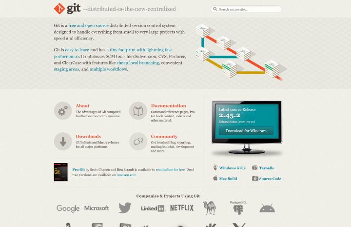
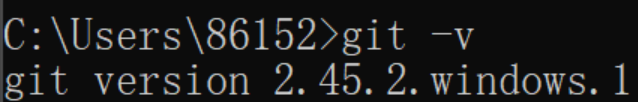
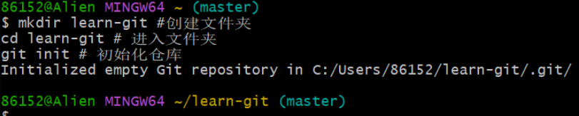
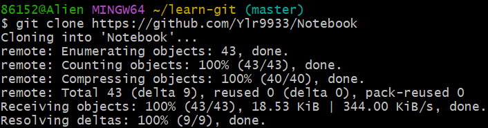

# git教程1

## 目录

- [git教程1](#git教程1)
  - [目录](#目录)
  - [什么是git](#什么是git)
  - [git的使用方式](#git的使用方式)
  - [安装和初始化配置](#安装和初始化配置)
  - [新建仓库](#新建仓库)

## 什么是git

Git 是一个开源的分布式版本控制系统，用于敏捷高效地处理任何或小或大的项目。超过90%的开源项目都在使用git进行版本控制，github，gitlab，gitee等网站上托管的开源项目也都是使用git来进行管理的，对开发者来说，掌握git可以说是必不可少的技能。

## git的使用方式

- 命令行
- 图形界面(GUI)
- IDE插件/扩展

## 安装和初始化配置

访问[git官网](https://git-scm.com/)选择下载\

选择download，安装完成后在终端输入指令查看版本信息

```git
git -v
```

如果能够看到版本信息，说明下载成功。安装git后会自动安装gitbash\


第一步，打开git bash，用git config命令配置用户名和邮箱

```git
git config --global user.name "YLR" # 如果用户名没有空格可以省略引号
gitconfig --global user.email 2840392900@qq.com
git config --global credential.helper store # 保存用户名和密码
git config --global --list # 查看git的配置信息
```

--global:全局配置，对所有仓库生效\
--system:系统配置，对所有用户生效\
缺省(Local):本地配置，只对本地仓库有效

## 新建仓库

版本库又叫仓库，英文名repository，简称repo，可以理解为一个目录，这个目录里面的所有文件都能被git管理起来，每个文件的修改，删除，添加等操作git都能跟踪到，以便任何时候都可以追踪历史或者还原到之前的某一个版本

方式一：git init，在自己电脑本地创建一个仓库\

```git
mkdir learn-git #创建文件夹
cd learn-git # 进入文件夹
git init # 初始化仓库
```



方式二：git clone，从远程服务器上克隆一个已经存在的仓库

```git
git clone "https://github.com/Ylr9933/Notebook" # 远程仓库地址
```

