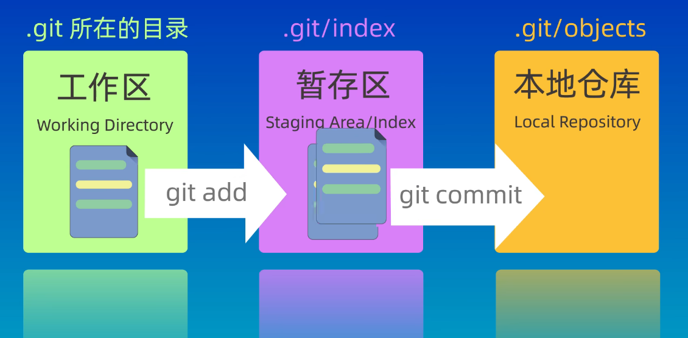
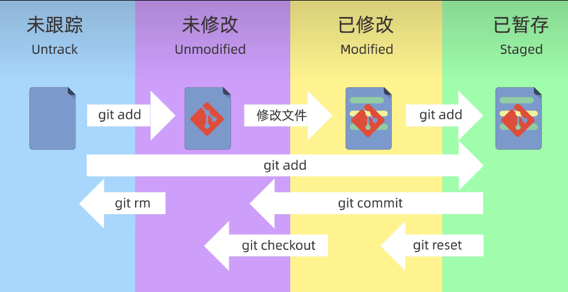
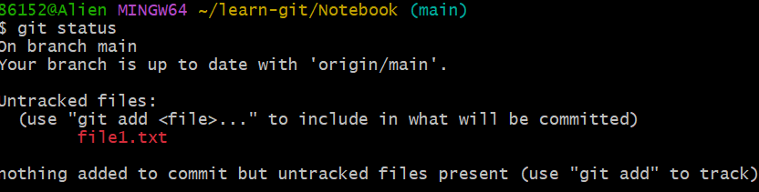
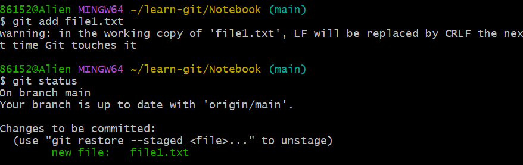
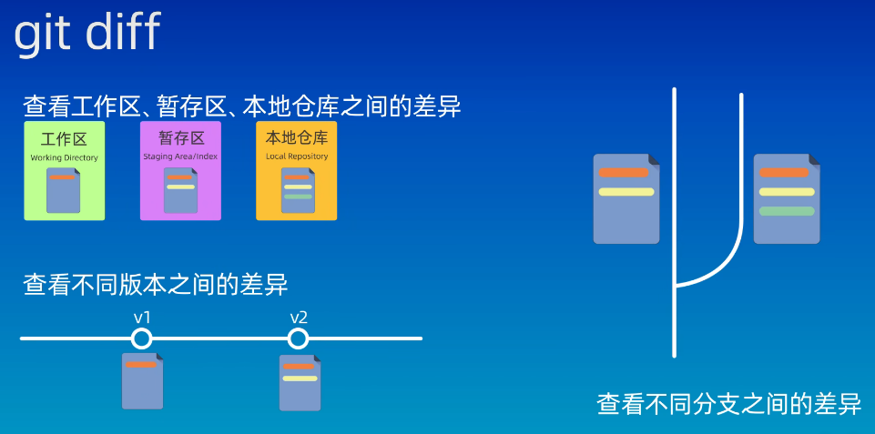

# git教程2

## 目录

- [git教程2](#git教程2)
  - [目录](#目录)
  - [git的工作区域和文件状态](#git的工作区域和文件状态)
  - [添加和提交文件](#添加和提交文件)
  - [回退版本](#回退版本)
  - [查看差异](#查看差异)
  - [删除文件](#删除文件)
  - [忽略文件](#忽略文件)

## git的工作区域和文件状态

git的工作区域分为三个区：\
工作区（Working Directory）:自己电脑上的本地目录，能够在资源管理器中看到的文件夹。\
暂存区（Staging Area/Index）：临时存储区域，用于保存即将提交到git仓库的修改内容。\
本地仓库（Loacl Repository）：通过git init创建的仓库，包含了完整的项目历史和元数据，是git存储代码和版本信息的主要位置

文件有四种状态：未跟踪（Untrack），未修改（Unmodified），已修改（Modified），已暂存（staged）


## 添加和提交文件

```git
git init # 创建仓库
git status # 查看仓库的状态
git add # 添加到暂存区
git commit # 提交
```

```git
echo "这是一个文件">file1.txt # 创建一个文件并写入内容
cat file1.txt # 打印文件内容
git status # 查看仓库状态
```

红色表示未被跟踪的文件


```git
git add file1.txt # 将文件添加到暂存区
git restore --staged file1.txt # 用于取消暂存
```

绿色表示这个文件已经被添加到暂存区，等待被提交


```git
git commit -m "第一次提交"

# 将文件提交到仓库中(只会提交暂存区中的文件)，-m后跟提交信息
```

```git
git add *.txt # 将所有txt后缀的文件提交，*是通配符
git add . # 将所有文件提交到暂存区，.表示当前目录
```

```git
git log # 查看提交记录（按q退出）
```

## 回退版本

```git
git reset --soft <ID> # 回退到某一个版本并且保留工作区和暂存区的所有修改内容
git reset --hard <ID> # 丢弃工作区和暂存区的修改内容
git reset --mixed <ID> # 只保留工作区的修改内容（默认参数）
```

后面是要回退的版本ID，用git log可以查看版本ID

## 查看差异 

指令：git diff


```git
git diff # 不加参数默认查看工作区和暂存区之间的差异
git diff HEAD # 查看工作区和版本库之间的差异
git diff --cached # 比较暂存区和版本库之间的差异
git diff <ID> <ID> # 比较两个版本之间的差异 
#  HEAD表示当前版本，HEAD~表示上一个版本
```

## 删除文件

```git
rm "filename" #删除工作区文件
git commit "filename" # 将改动提交到暂存区
git commit # 将改动提交到版本库
```

## 忽略文件

.gitignore文件中保存的是不提交到版本库中的文件名，前提是这个文件在版本库中不存在
